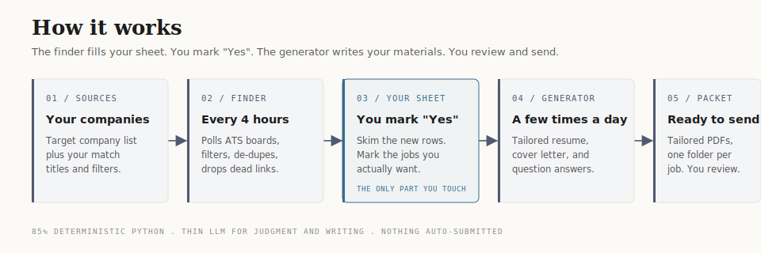

# ai-talent-partner

A self-hosted AI job-search agent you run yourself. It finds jobs that match what you want,
keeps them in a spreadsheet you curate, and for any job you mark "Yes" it writes a tailored
resume, a tailored cover letter, and answers to the posting's real questions, in your voice and
your formatting. You stay in control; the agent does the grinding.



This is a "build your own" repo. Clone it, open it with Claude Code or Codex, and run setup.
It interviews you, builds your config, and stands up the whole loop.

## Get started

This is a clone-and-customize repo, not an npm package, so there is no `npx ai-talent-partner` one-liner. Clone it and drive it with your coding agent:

```
git clone https://github.com/derekcedarbaum2/ai-talent-partner.git
cd ai-talent-partner
```

Want a clean copy with no git history, so you can make it your own private repo? Use degit instead:

```
npx degit derekcedarbaum2/ai-talent-partner my-job-search
cd my-job-search
```

Either way, open the folder with Claude Code or Codex and say "set up" (or run `/setup`). The setup
skill will:

- ask for your existing resume, cover letter, LinkedIn, portfolio, and GitHub,
- ask your target titles, industries, geographies, and hard constraints,
- build your company list, match terms, profile, and accomplishment bank,
- create your spreadsheet (Google Sheets or local CSV/Excel),
- install the schedulers and do a first run so you see rows appear.

You can also do it by hand: copy `config/config.example.json` to `config/config.json`, fill in the
`config/*.example.md` files, and run the scripts in `scripts/`. See `docs/SETUP.md`.

## The loop

1. A finder runs on a schedule (every ~4 hours). It checks your target companies' job boards,
   keeps only postings that match your titles and filters, and appends new ones to your sheet.
   It de-dupes, drops dead/closed links, and tags each row with the date and source.
2. You open the sheet whenever you like. In the last column, "Will I apply?", you type **Yes**
   for any job you actually want to pursue. Leave it blank or type No for the rest.
3. A generator runs a few times a day. For every Yes row that does not have materials yet, it
   produces a tailored resume, a cover letter, and an `application-questions.md` answering the
   posting's substantive questions, into `<workspace>/applications/<Company> - <Role>/` (the
   `applications_dir` config key).
4. You review, finalize, and send. Nothing is auto-submitted.

That is the whole product. The finder fills the sheet, you mark Yes, the generator writes your materials.

## How to mark jobs (the part people miss)

The "Will I apply?" column is the switch. Type **Yes** in that cell for a job and the next generator
run builds your materials for it. It generates once per job, tracked by URL in `state/generated.json`,
so marking more jobs over time just queues more work; nothing regenerates twice. To regenerate a job,
remove its URL from `state/generated.json` and delete its folder. Deleting the folder alone does not
trigger a regen.

## What is in here

- `skills/setup` : the onboarding skill that runs on first clone.
- `skills/accomplishment-interview` : builds your accomplishment bank (the source of truth for all materials).
- `skills/resume-customizer`, `skills/cover-letter`, `skills/positioning`, `skills/sense-of-style` : the writing engine.
- `scripts/` : the deterministic finder (ATS pollers, filters, de-dupe, liveness, sheet I/O) and the generator runner.
- `templates/resume.html`, `templates/cover-letter.html` : the default styling your materials render into. Restyle freely.
- `config/` : your company list, match terms, and settings. The `.example` files ship; your real ones stay local.
- `config/seed-companies/` : starter company lists for defense, robotics, and AI (hundreds of real, public companies). Use them as-is, mix and match, and add any industry you want. The setup skill offers these and researches anything they do not cover.
- `docs/WORKSPACE.md` : your personal data (accomplishment bank, profile, generated materials) lives in a separate workspace folder you choose at setup, not in this repo. This explains the layout.
- `launchd/` and `docs/` : scheduler setup for macOS and Linux, plus architecture and auth notes.
- `AGENTS.md` : how to run the same flows from Codex / Cursor / other agents.

## How the finder is built

Most jobs live on a handful of applicant tracking systems (Greenhouse, Lever, Ashby) that expose free
public JSON APIs with real post dates. The finder hits those directly: fast, accurate, no scraping.
Companies on custom sites are checked with a rotating web search. About 85% of the work is plain Python
(fetch, filter, de-dupe, liveness-check); the model is used only for the judgment calls and the writing.
That keeps it cheap to run on a schedule.

## Requirements

- Python 3.
- Claude Code or Codex (or another capable coding agent). The skills are written as plain markdown,
  so any agent that can read and follow them works; `AGENTS.md` covers the non-Claude-Code path.
- A scheduler: macOS `launchd` (examples included) or Linux `cron`. The schedulers only fire while the
  machine is awake; a missed run just catches up next time, since de-dupe means nothing is lost.
- Chrome or Chromium, used as the PDF renderer for resumes and cover letters. No Chrome? Set
  `render.engine` to `"none"` in config and you get HTML only.
- Optional: a Google account if you want the Google Sheets backend instead of local CSV/Excel.

## Cost and recommended plans

This runs a real language model on a schedule: the finder several times a day, the generator whenever
you mark jobs Yes. That is not free. Run it on a flat-rate subscription, not metered API billing: a
busy week on per-token pricing is a surprise bill.

Recommended: the 100 dollar per month or 200 dollar per month Claude or Codex plan. On those plans the
scheduled runs are covered by your subscription, which is the whole point of self-hosting this. If you
point it at metered per-token API billing instead, watch your usage closely and consider lowering the
finder frequency, shrinking the company list, or setting the model to a cheaper tier in config.

Tuning levers if cost is a concern: raise the finder cron interval, cut the company list, raise
`web_shard_count` so fewer web searches run per pass, and keep `model` on the cheaper tier.

## Safety, privacy, and ethics

- Nothing is auto-submitted. The agent writes drafts; you review and send. Read every draft first.
- Do not mass-spam applications. The point is better-targeted applications, not more of them. Curate the Yes column.
- Your personal data (accomplishment bank, profile, generated materials) stays in your local workspace, outside the repo. Never commit it.
- If you use the Google Sheets backend, your OAuth token is a credential. The default token path lives outside the repo (`~/.config/ai-talent-partner/`). If you store it in-repo, the `*google_token*.json` gitignore entry covers the default filename; if you rename it, verify yours is ignored. Never paste it anywhere public.
- Do not run the agent with permission guards disabled. The schedulers use a least-privilege tool allowlist on purpose.
- The materials are only as truthful as your accomplishment bank. The skills never invent; do not add claims you cannot stand behind.

## What it does not do

- It does not auto-submit applications. You review and send.
- It cannot read a job's salary, experience bar, or location if the posting does not state them; filters
  apply only to what is published.
- Custom career sites that return a normal page for a closed job (no API behind them) can occasionally
  leave a stale row; the liveness sweep catches everything on the major ATS platforms.

MIT licensed. Fork it, change it, make it yours.
